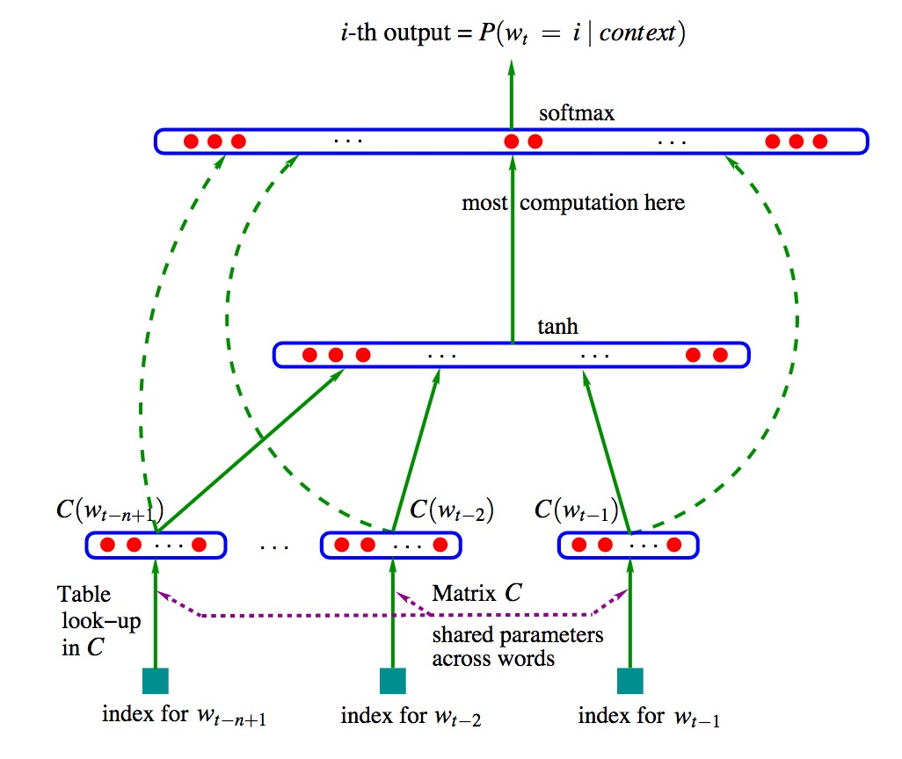
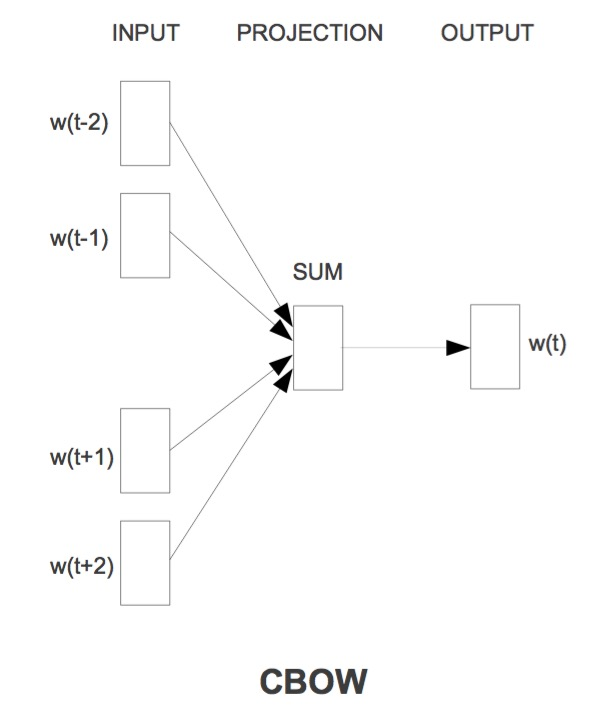
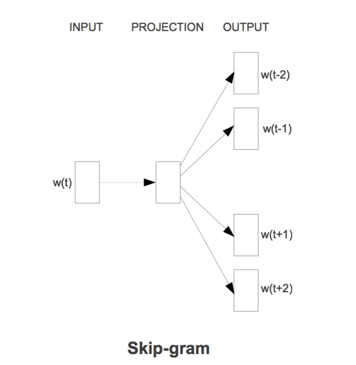

<script type="text/javascript" src="http://cdn.mathjax.org/mathjax/latest/MathJax.js?config=default"></script>


## 词向量

在自然语言处理中，需要将具体的文字数字化，那么就可以当做常规的机器学习问题。

比如短文本分类，首先是一个句子的形式，需要转化为单个词语。然后还需要转化为具体数字，用来描述、分析词之间的关系等等。

**One-hot Representation**

比如

```
苹果 [0 0 0 1 0 0 0 0 ...]
香蕉 [0 0 0 0 0 0 1 0 ...]
```
那么每个词就是一堆0的中的1.
这种称为 **One-hot Representation**，一种编码方式。那么数字化之后，就可以作计算。

不过这种表示方式，词表的矩阵是个稀疏矩阵，如果词汇量很大，那么会是一个很大的维度，作存储和计算都不是很理想；而且对于词之间的关系也无法体现。那么存在另一种方式

**Distributed Representation**

与One-hot Representation想法类似，不过更为精简，人们希望可以这样：

```
[0.302 0.123 0.690 ...] 

```
一般只有50，100维度。就足以表达成千上万词汇。并且还能计算词之间的关系。比如 苹果，香蕉。应该很接近才是，因为都是水果。word2vec就可以训练这样的词向量。

**word2vec**

word2vec是Google开源的一个高效计算词向量的工具。计算得到的词向量可应用于各种NLP任务。其高效在于使用了2种模式cbow和skip-gram.


## NNLM

word2vec作为一种简化的神经网络模型。在了解内部原理之前，我们需要知道下 NNLM网络结构。

NNLM 即 Neural Network Language Model，由Bengio提出《A Neural Probabilistic Language Model》




图中，该网络分2层，从低往上，输入层，隐藏层，输出层。

$$w_{t-n+1},...w_{t-2},w_{t-1}$$表示前面n-1个词，来预测下一个词$$w_t$$.

图中有个 **C**,其实就是词汇表，存放着相应的词向量。$$C(W)$$就是对应的词向量。这里输入的词向量其实是个index。

第一层，n-1个词$$C(w_{t-n+1}),...C(w_{t-2}),C(w_{t-1})$$，首尾相连，形成(n-1)m维的向量。m为单个词向量维度，比如100。

第二层，也就是隐藏层，$$d+Hx$$计算得到。d是偏置项，H是隐藏层参数($$H=h(n-1)m$$).x就是第一层的输入。

第三层，有$$V$$个节点，也就是词汇表$$C(V*m)$$的大小，每个节点的输出$$y_i$$表示下一个词是i的概率，也就是总共有V个概率，取最大的概率咯。这里的y是未归一化的log概率.

 $$y=b+Wx+Utanh(d+Hx)$$

 $$W(V×(n-1)m)$$ 也就是上图中左边的虚线，输入层到输出层的直连。如果去掉直连，那么W参数就为0了。

 $$U(V×h)$$就是隐藏层到输出层的参数

 $$b(V)$$ bias项

那么这里所有的参数$$\theta$$

 $$\theta=(b,d,W,U,H,C)$$

分析完成，那么接下来就是一个求解神经网络的问题，论文中用的是随机梯度下降法优化出来。这里有点特别的是，输入层参数C，也就是词向量，也是参数，也要求解的，与一般的神经网络不同的地方。
解出来，我们会得到2样东西，一个C，也就是词向量，还有一个是语言模型。本文我们只谈词向量。


## word2vec

在NNLM中计算的开销主要在于隐藏层，以及因此层到输出层的参数计算。
在word2vec所以干脆去掉了隐层。大大提高了计算效率，并提出了2种模型CBOW和skip-gram

### CBOW

CBOW是Continuous Bag-of-Words Model。与NNLM模型类似，不过去掉了隐藏层。



由图可以看出来，这里的输入是直接求和到隐藏层。要求的是

$$P(w_t|w_{t-k},w_{t-k+1},...w_{t+k},)$$

与NNLM不同的地方

* 在NNLM中是词向量首尾相连变成很长的一串，这里是直接求和/求平均

* 这里的求t，用了t前后的词向量，而前面是前n-1个词。似乎看起来这样更合理，因为考虑了将来的词。

* CBOW去掉了隐藏层复杂的计算。

inut到project层，来看下源代码，我加了注释。

``` c++
	  //随机选择窗口大小
     b = next_random % window;
     if (cbow) {  //train the cbow architecture
      // in -> hidden
      cw = 0;
      for (a = b; a < window * 2 + 1 - b; a++) if (a != window) {
        //以 sentence_position 为中心 前后各 window - b 个词
        c = sentence_position - window + a;
        if (c < 0) continue;
        if (c >= sentence_length) continue;
        last_word = sen[c];
        if (last_word == -1) continue;
        //窗口内词向量相加
        for (c = 0; c < layer1_size; c++) neu1[c] += syn0[c + last_word * layer1_size];
        cw++;
      }
	  if (cw) {
        //相加的词向量取平均
        for (c = 0; c < layer1_size; c++) neu1[c] /= cw;
```

那么接下来就是project层到输出层的计算。这里又有2种方式， **Hierarchical Softmax**和 **NEGATIVE SAMPLING**。


**Hierarchical Softmax**

关于这个思想的提出，我们想下之前的NNLM中的输出有|V|个节点，对于每个节点都要计算其是不是的概率值，那么计算量还是比较大的。

如果换个思路，我们先把词语分个类，做个编码。比如，苹果。先判断是不是水果，再判断是不是苹果。论文中的方法，是先对所有词作Huffman编码。那么高频词的编码就很短。所有的词都是Huffman树的一个节点。

假如$$w$$=苹果。其编码是1010.那么$L(w)=5$，算上root根节点。表示该词所在节点到root根节点的距离是4。$$n(w,j)$$表示root通往w的第j个节点，$$n(w,1)$$=root,
$$n(w,L(w))=w$$

输出：

$$P(w_O|w_I)=\Pi_{j=1}^{L(w)-1}\sigma([n(w,j+1)=ch(n(w,j))]*{v_{n(w,j)}^{'}}^{T} v_{wI} )$$

这里的$$\sigma(x)=\frac{1}{1+e^{-x}}$$

$$[n(w,j+1)=ch(n(w,j))]$$表示$$n(w,j+1)$$是$$n(w,j)$$的一个子节点，感觉这是很显然的事，又多这么一个概念。

[x]表示x=true 则为1，否则为-1。

$$v_n$$表示Huffman树的inner(内部)节点也就是非叶子节点；

$$v_w$$表示Huffman树的叶子节点，也就是一个个词。

那么 具体如何求解，我们看下代码

``` c++
		//Hierarchical Softmax 也就是根据初始化的 vocab 词汇表的huffman编码来计算输出f值，
        if (hs) for (d = 0; d < vocab[word].codelen; d++) {
          f = 0;
          l2 = vocab[word].point[d] * layer1_size;
          // Propagate hidden -> output
          for (c = 0; c < layer1_size; c++) f += neu1[c] * syn1[c + l2];
          if (f <= -MAX_EXP) continue;
          else if (f >= MAX_EXP) continue;
          //f值转化到0.01～1 之间 查表expTable得到，expTable的默认大小为EXP_TABLE_SIZE＝1000
          else f = expTable[(int)((f + MAX_EXP) * (EXP_TABLE_SIZE / MAX_EXP / 2))];
          // 'g' is the gradient multiplied by the learning rate
          // 1 - vocab[word].code[d] 表示word的第d位huffman编码 0或者1 用来表示目标值，减去输出f 计算g
          g = (1 - vocab[word].code[d] - f) * alpha;
          // Propagate errors output -> hidden
          //g * syn1[c + l2] 梯度部分,误差回传 隐层。在后面 neu1e会继续回传到输入层，用来优化syn0
          for (c = 0; c < layer1_size; c++) neu1e[c] += g * syn1[c + l2];
          // Learn weights hidden -> output
          for (c = 0; c < layer1_size; c++) syn1[c + l2] += g * neu1[c];

```

这里的syn1其实就是上面提到的Huffman的inner(内部)节点。

$$f=\sigma(neu1^Tsyn1)$$

梯度

$$g = (1 - vocab[word].code[d] - f) * alpha$$


1 - vocab[word].code[d] 表示word的第d位huffman编码 0或者1,比如苹果的第0位是1.


**NEGATIVE SAMPLING**


再说一下另一种方式，NEGATIVE SAMPLING。主要的思想是，随机生成一些负样本，如果命中 word 则 label=1 不更新误差；否则更新误差 更新网络参数

代码：

```
		//负采样 (默认采用这种方式)
        //随机选择 negative 个词，如果命中 word 则 不更新误差；否则更新误差 更新网络参数
        // NEGATIVE SAMPLING
        if (negative > 0) for (d = 0; d < negative + 1; d++) {
          if (d == 0) {
            target = word;
            label = 1;
          } else {
            next_random = next_random * (unsigned long long)25214903917 + 11;
            target = table[(next_random >> 16) % table_size];
            if (target == 0) target = next_random % (vocab_size - 1) + 1;
            if (target == word) continue;
            label = 0;
          }
          l2 = target * layer1_size;
          f = 0;
          for (c = 0; c < layer1_size; c++) f += neu1[c] * syn1neg[c + l2];
          if (f > MAX_EXP) g = (label - 1) * alpha;
          else if (f < -MAX_EXP) g = (label - 0) * alpha;
          //查表
          else g = (label - expTable[(int)((f + MAX_EXP) * (EXP_TABLE_SIZE / MAX_EXP / 2))]) * alpha;
          for (c = 0; c < layer1_size; c++) neu1e[c] += g * syn1neg[c + l2];
          for (c = 0; c < layer1_size; c++) syn1neg[c + l2] += g * neu1[c];
```

与前面的差别在于 

$$g = (label - f) * alpha$$

用label代替 1 - vocab[word].code[d].而这个label是随机生成的，当然是考虑了词频的随机抽样。


### Skip-gram

Skip-gram的模型图与cbow正好反一下。



由当前词去推周围词的概率。

见代码注释。

``` c++
} else {  //train skip-gram
      for (a = b; a < window * 2 + 1 - b; a++) if (a != window) {
        c = sentence_position - window + a;
        if (c < 0) continue;
        if (c >= sentence_length) continue;
        last_word = sen[c];
        if (last_word == -1) continue;
        l1 = last_word * layer1_size;
        for (c = 0; c < layer1_size; c++) neu1e[c] = 0;
        // HIERARCHICAL SOFTMAX
        if (hs) for (d = 0; d < vocab[word].codelen; d++) {
          f = 0;
          l2 = vocab[word].point[d] * layer1_size;
          // Propagate hidden -> output
          // skip-gram与cbow之间的差别
          // 这里的f 是直接输入 syn0 与输出syn1相乘
          // 而cbow中 是输入的向量相加取平均后再作计算
          // skip-gram的理念在于 用当前输入的词 word[t] 去推 上下文 word[t-2] word[t-1] word[t+1] word[t+2]的概率.
          // 具体的计算目标就是优化输出syn1对应的上下文词向量
          for (c = 0; c < layer1_size; c++) f += syn0[c + l1] * syn1[c + l2];
          if (f <= -MAX_EXP) continue;
          else if (f >= MAX_EXP) continue;
          else f = expTable[(int)((f + MAX_EXP) * (EXP_TABLE_SIZE / MAX_EXP / 2))];
          // 'g' is the gradient multiplied by the learning rate
          g = (1 - vocab[word].code[d] - f) * alpha;
          // Propagate errors output -> hidden
          for (c = 0; c < layer1_size; c++) neu1e[c] += g * syn1[c + l2];
          // Learn weights hidden -> output
          for (c = 0; c < layer1_size; c++) syn1[c + l2] += g * syn0[c + l1];
        }

```


### PS

短短700行的代码，做完了所有的事情。虽然代码风格很豪放，一堆abc变量名<code>:P</code>

不过编译运行还是很方便的，无任何依赖了，甚至连随机数生成都自己写。。。

这里再推荐几篇文章 @licstar的[《Deep Learning in NLP （一）词向量和语言模型》](http://licstar.net/archives/328)，关于词向量的前世今生讲的很详细；

还有网易的[Deep Learning实战之word2vec](http://techblog.youdao.com/?p=915)有代码讲解，还有word2vec相关人物的八卦😄～


### 参考

1.[word2vec](https://code.google.com/archive/p/word2vec/)

2.[A Neural Probabilistic Language Model](http://www.jmlr.org/papers/volume3/bengio03a/bengio03a.pdf)

3.[Distributed Representations of Words and Phrasesand their Compositionality]()

4.[Deep Learning in NLP （一）词向量和语言模型](http://licstar.net/archives/328)

5.[Deep Learning实战之word2vec](http://techblog.youdao.com/?p=915)